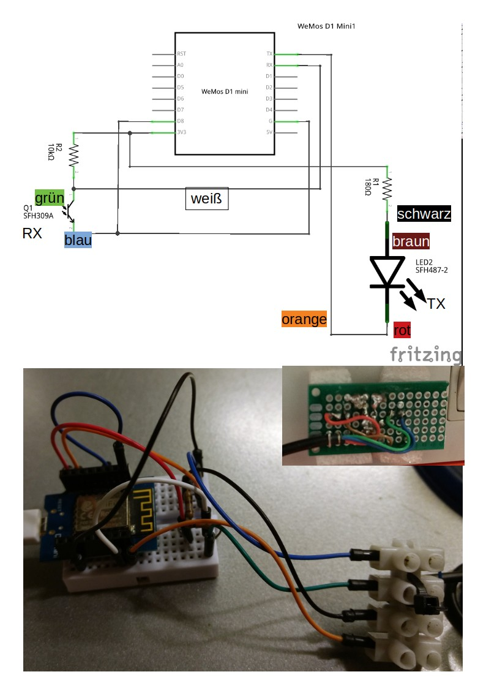

MyVitotronicLogger
==================
Vissmann boiler logger with DIY OptoLink interface.  

AST, 12.03.2019


Motivation
----------
For a Vissmann boiler with a control interface Vitotronic 200 KW1 (V200KW1):   
* How much energy is consumed?
* How to monitor the boiler's temperatures?
* What is the boiler doing over time?
* How to interface with the boiler?

(DE) "Witterungsgeführte Kesselregelung für gleitend abgesenkte Kesselwassertemperatur"  


Solution Approach
-----------------
* Use the optical maintenance interface of the Vitotronic control interface.
	* <https://github.com/openv/openv/wiki/Die-Optolink-Schnittstelle>
	* KW Protocol, <https://github.com/openv/openv/wiki/Protokoll-KW>
* Use Arduino ESP8266 with a DIY optocoupler interface, see <https://github.com/openv/openv/wiki/Bauanleitung-ESP8266>
* Use VitoWiFi library
	* Arduino Library for ESP8266 to communicate with Viessmann boilers using a (DIY) serial optolink.
	* <https://github.com/bertmelis/VitoWiFi.git>
    * Many thanks for this gread library!
	* Based on the fantastic OpenV library


Requirements
------------
* ESP8266, e.g., Wemos D1 Mini
* OptoLink interface: <https://github.com/openv/openv/wiki/Bauanleitung-ESP8266>
* Libraries for:
	* Arduino, e.g., *Arduino IDE*
	* ESP8266 / Wemos D1 Mini
	* VitoWiFi, <https://github.com/bertmelis/VitoWiFi>
		* Tested working version was [Version 1.0.2 from 10.11.2018](https://github.com/bertmelis/VitoWiFi/tree/5d8a2d5b270df575b2cb3b8847567947bac362e9)
* Optional: RS232 USB cable for Serial1 observation (attach to D4)


Circuit / Wiring
----------------
  


  
(See also https://github.com/openv/openv/wiki/Bauanleitung-ESP8266)  


Debugging
---------------
1. Attach to opto coupler 
2. Attach RS232 USB cable to D4 to listen for Serial1 messages. **Serial1/UART1 TX pin is D4.**

**Do not connect to RX/TX because those are reserved for opto-coupler communication!**

For debugging the Serial1 Arduino software UART is being used.

  > Serial1.begin(115200);

All logging and status messages are being print using `Serial1.print`.  
Serial1 uses UART1 which is a transmit-only UART.  


Development
---------------

### vitowifitests
Testing project to test the OptoLink interface.
1. Attach to opto coupler 
2. Attach RS232 USB cable to D4 to listen for Serial1 messages. **Serial1/UART1 TX pin is D4.**

Example output:
```
temperature - boilerTemp is 32.4
temperature - STS1 is 48.5
temperature - RTS is 20.0
temperature - AGTS is 20.0
temperature - RLTS is 20.0
temperature - VLTS is 20.0
temperature - setRoomTemp is 309.2
temperature - setRoomReducedTemp is 513.2
burner - runHours is 10272.3
burner - starts is 199182
operation - currentOperatingMode is 2
pump - a1m1Pump is true
pump - storePump is false
pump - circuitPump is false
```


### vitowifimqtt
Working Arduino project.
Sends collected data from OptoLink interface to MQTT server.  

Example output:
```
/esp/VitoWiFi/ip 192.168.1.108
/esp/VitoWiFi/outsideTemp 8.9
/esp/VitoWiFi/boilerTemp 56.6
/esp/VitoWiFi/STS1 47.7
/esp/VitoWiFi/RTS 20.0
/esp/VitoWiFi/AGTS 20.0
/esp/VitoWiFi/RLTS 20.0
/esp/VitoWiFi/VLTS 20.0
/esp/VitoWiFi/setRoomTemp 309.2
/esp/VitoWiFi/setRoomReducedTemp 538.8
/esp/VitoWiFi/runHours 10274.3
/esp/VitoWiFi/starts 199237
/esp/VitoWiFi/currentOperatingMode 2
/esp/VitoWiFi/a1m1Pump true
/esp/VitoWiFi/storePump false
/esp/VitoWiFi/circuitPump false
```

### Pictures


My setup and wiring:



Links
-----
* [OpenV](https://github.com/openv/openv/wiki/)
* [Anbindung der Heizungssteuerung über Optolink](https://www.harrykellner.de/index.php/projekte2/81-optolink)
* [Talking to Viessmann Vitodens 200](https://www.edom-plc.pl/index.php/en/1-wire-i-rpi-en/175-komunikacja-z-viessmann-em-vitodens-200)
* <http://www.rainer-rebhan.de/proj_vvt_manager.html>

